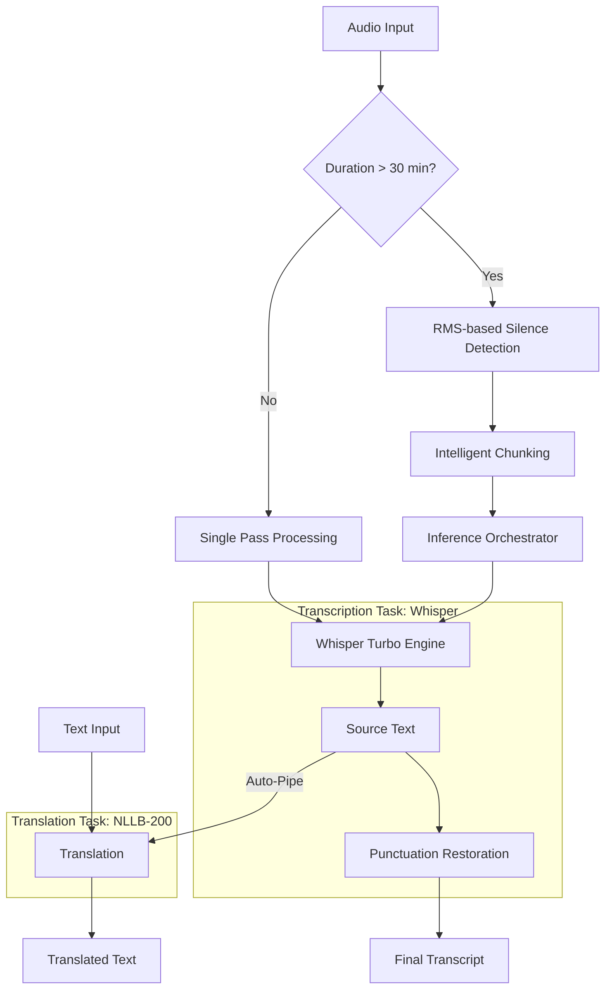

# Production-Ready ASR Pipeline: Whisper Turbo + NLLB Translation

An offline-first, silence-aware audio processing engine designed for long-form transcription, handling model-dependency breakage and multi-language translation at scale.

---

# Quick Start
```bash
# 1. Clone & Navigate
git clone https://github.com/S-Olmi/whisper-audio-to-txt (https://github.com/S-Olmi/whisper-audio-to-txt) && cd whisper-audio-to-txt

# 2.Copy the template and fill in your `API_TOKEN`
cp .env.example .env

# 3.Build the engine and Run with environment injection
docker build -t whisper-api .
docker run -d -p 8000:8000 --env-file .env --name whisper-service whisper-api

# 4. Test it (Transcription)
curl -X POST http://localhost:8000/transcribe -F "file=@your_audio.mp3"
```
For detailed configuration and advanced parameters, see [Usage](#usage)

---

## Models Used
| Component       | Model              | Task          | Why this choice?                                   |
|-----------------|--------------------|---------------|----------------------------------------------------|
| **ASR**         | `Whisper Turbo`      | Transcription | Best-in-class Speed/Accuracy ratio.                |
| **Translation** | `NLLB-200-distilled` | Any-to-Any MT | Handles 200+ languages with low VRAM footprint.    |
| **Punctuation** | `PunctuationModel`   | Restoration   | Custom patched to handle legacy dependency breaks. |

---

## Engineering Highlights

- **Dynamic Silence-Aware Chunking**  
Optimized processing for long-form audio (>30 min) using RMS-based silence detection. This prevents word-clipping and hallucinations while maintaining memory efficiency.

- **Decoupled ASR & Translation**  
**Meta’s NLLB-200**, enabling high-quality "any-to-any" translation despite the base model's limitations.

- **Offline-First & Privacy-Centric**  
Fully local execution with lazy model loading and caching, ensuring zero data leakage and zero API costs.

- **Security-First Design**
Implementation of constant-time token validation to prevent side-channel attacks, ready for cloud-edge deployment.
 
---

## System Architecture
The system is architected as a linear data pipeline with conditional heuristic branching. Instead of a naive "file-to-model" approach, it evaluates the audio telemetry (RMS levels and duration) to determine the most efficient processing strategy, ensuring data integrity and minimizing hallucinations before reaching the inference engines.



### Data Pipeline Approach
Unlike standard wrappers, this pipeline implements a **Pre-Inference Analysis** stage. By calculating the **Root Mean Square (RMS)** of the signal, the system identifies natural pauses in speech. This allows the orchestrator to partition long-form audio at silence points rather than arbitrary timestamps, preserving the linguistic context for the Transformer's attention mechanism and significantly reducing Word Error Rate (WER) in long-form transcriptions.

---

## Logic Validation: Smart Chunking
The **Smart Chunking** logic is triggered for files > 30 minutes to optimize VRAM usage while maintaining transcription context.

| Feature | Standard Slicing (Fixed 30m)  | Smart Chunking (Silence-aware)         |
| :--- |:------------------------------|:---------------------------------------|
| **Boundary Logic** | Arbitrary at 1800.0s          | Dynamic (searches for RMS < threshold) |
| **Context Retention** | Risks cutting sentences/words | Preserves linguistic units             |
| **VRAM Efficiency** | Constant                      | Optimized per chunk density            |

> **Analysis:** In a 60-minute test file, fixed slicing caused a break during a 0.5s word pronunciation. The RMS logic shifted the split point by 2.4s to a natural pause, eliminating "fragmentation hallucinations" in the Whisper output.

---

## Technical Challenges & Decisions

### Managing Model Technical Debt (The Punctuation Patch)
The `PunctuationModel` dependency was functionally abandoned, causing breaking changes with the latest `transformers` library. Instead of using an outdated environment or an unmaintained fork, I **manually patched the model logic** to ensure compatibility with the modern AI ecosystem. This guarantees long-term maintainability of the pipeline.

### Intelligent Audio Partitioning
Traditional fixed-length chunking (e.g., every 30s) often cuts off sentences mid-word, leading to ASR hallucinations. I implemented a **conditional chunking strategy**:
- **Audio < 30min**: Processed in a single pass to maintain maximum context.
- **Audio > 30min**: Segmented based on **RMS (Root Mean Square)** silence detection. This evolution was driven by empirical observations on latency, accuracy, and the need to avoid unnecessary fragmentation.

### Security Foresight: Constant-Time Validation
Even though the current version runs locally, I implemented `secrets.compare_digest` for token comparison. This prevents **timing attacks**, a critical vulnerability in production environments where an attacker could guess a token by measuring response times. This reflects a "Production-First" mindset, preparing the CLI for a future microservice transition.

### Decoupled Input Orchestration
To maximize system usability, the translation endpoint was designed to be input-agnostic. It implements orchestration logic that reuses the ASR pipeline as a data provider for the NLLB translation engine. This reduces code duplication and enables end-to-end translation from audio sources, while addressing latency limitations through model caching.

---

## System Trade-offs

### Throughput vs. Absolute Accuracy
I selected `Whisper-Large-v3-Turbo` instead of `large-v3`. Trade-off: a negligible ~1-2% drop in accuracy for a **~10x increase in inference speed**, which is the preferred balance for most real-world applications.

### System Orchestration vs. Fine-Tuning
No fine-tuning was performed. The focus was placed on **robustness and orchestration** (chunking, silence detection, error handling). In production, these system-level optimizations often provide more stability than a slightly better-tuned model on biased data.

### Local VRAM Dependency
By choosing a local-first approach, the system requires a GPU/CPU with sufficient memory. This was a conscious trade-off to prioritize **data privacy and zero operational costs** over the infinite scalability of expensive Cloud APIs.

---

## Usage
### 1. Transcription (Audio to Text)
Standard ASR pipeline with punctuation restoration.
```bash
curl -X POST http://localhost:8000/transcribe \
  -H "Authorization: Bearer YOUR_TOKEN" \
  -F "file=@meeting_audio.wav"
  ```
### 2. Unified Translation
#### Case A: From Audio File
```bash
curl -X POST http://localhost:8000/translate \
  -F "audio_file=@french_interview.mp3" \
  -F "src_lang=fr" -F "tgt_lang=it"
  ```
#### Case B: From Raw Text
```bash
curl -X POST http://localhost:8000/translate \
  -F "text=Bonjour tout le monde" \
  -F "src_lang=fr" -F "tgt_lang=it"
  ```

---

## Production Roadmap
To transition this pipeline from a standalone tool to a high-availability service, the following architectural steps are planned:
- **Request Queueing**: Moving from synchronous processing to an **asynchronous task-based system**. This would allow handling multiple concurrent user uploads without overloading the GPU/CPU.
- **Horizontal Scaling**: Leveraging the existing Docker configuration to deploy across multiple nodes (Orchestration), allowing the system to handle peak traffic by spinning up additional inference workers.
- **Performance Telemetry**: Implementing metrics to track the **Real-Time Factor (RTF)** and VRAM efficiency. This is crucial for optimizing cost-per-transcription in a cloud environment.
- **Inference Optimization**: Exploring **Batch Processing** to maximize GPU throughput, ensuring that multiple short audio streams are processed in parallel within a single model forward pass.

---

# Detailed Installation

## Running the Service (Docker)

The service is fully containerized and includes all required system dependencies (including FFMPEG).

### 1. Environment Configuration

```bash
cp .env.example .env
```

Set an `API_TOKEN` inside the `.env` file. Set also if you want to run the script using a cpu or cuda (GPU).
Even though the service runs locally, the token must be provided when calling the API (via Swagger).

---

### 2. Build and Run

```bash
docker build -t whisper-api .
docker run -d -p 8000:8000 --env-file .env --name whisper-service whisper-api
```

The Docker image already includes the required model weights and runs fully offline.

---

## Running the Service (Python Script)

### 1. Environment Configuration

```bash
cp .env.example .env
```

Set an `API_TOKEN` inside the `.env` file. Set also if you want to run the script using a cpu or cuda (GPU).
Even though the service runs locally, the token must be provided when calling the API (via Swagger).

---

### 2. Requirements

In order to run the script, the following requirements are needed:

- Python 3.10+
- FFmpeg

To install FFmpeg, simply run in your terminal

```bash
sudo apt-get update && apt-get install -y ffmpeg 
```

To install Python, visit and follow instructions on ``https://www.python.org/downloads/``

---

### 3. Install dependencies and Run

```bash
pip install -r requirements.txt
```

```bash
uvicorn main:app --reload --host 0.0.0.0 --port 8000
```

On first launch, the application downloads the required Whisper and DeepPunctuation model weights.
Subsequent runs operate fully offline, using the cached weights.

---

## Using the API (Swagger UI)

The service is designed to be used primarily through **Swagger**, as it simplifies authentication, file uploads, and parameter inspection during development and testing.

After starting the container (or running `uvicorn` locally), open:

``http://localhost:8000/docs``


### How to use Swagger:

1. Click **Authorize**
2. Insert your Bearer Token:

   ```
   Bearer YOUR_API_TOKEN
   ```
3. Select the transcription endpoint
4. Upload an audio file
5. Execute the request and inspect the JSON response

This workflow is recommended and reflects how the service was developed and tested.

---

## Output Format (Example)

The API returns a structured JSON response.

-1. Transcribe Endpoint:
```json
{
  "filename": "STROIE5483928404.mp3",
  "language": "en",
  "status": "ok",
  "refined_text": "Close your eyes, exhale, feel your body, relax and let go of whatever you're carrying. Today, well, I'm letting go of the worry that I wouldn't get my new contacts in time for..."
}
```

- **filename**: original uploaded filename
- **language**: language code used for transcription (e.g. `it`, `fr`, `en`, `de`, ...)
- **status**: transcription status  
- **refined_text**: cleaned transcription (with punctuation restoration when supported)

-2. Translate Endpoint:
```json
{
   "input_type": "audio (text)",
  "original_text": "Pour résider et pour négocier dans des territoires musulmans comme Tunis et Alexandrie...",
  "translated_text": "Per resistere e negoziare in territori musulmani come Tunisi e Alessandria...",
  "source_lang": "fr",
  "target_lang": "it"
}
```
- **input_type**: "audio" if the input to translate is an audio file, "text" if the input is a str of text
- **original_text**: original version of the refined transcription
- **translated_text**: translated version of the refined transcription
- **source_lang**: language of the original text 
- **target_lang**: language of the final text

---

## Input Example

The input consists of a **real audio file** (any supported format) and an optional `language` query parameter (str, default: `it`)  
There is no fixed duration limit; processing time scales linearly with file length, subject to available system resources.

All audio formats are supported as long as they can be decoded by FFMPEG, since every file is converted to a normalized `.wav` during preprocessing.

---

## CPU vs GPU Execution

- The **default configuration runs on CPU**, as the project was developed on a machine without a GPU.
- If a GPU is available, transcription would be significantly faster.

---

## Testing
To ensure pipeline reliability and prevent regressions in the audio processing logic, the project includes:

* **Unit Tests:** Validating the deduplication heuristics and chunking logic.
* **Integration Tests:** Verifying the full E2E flow from raw audio to translated text.

Run the suite using:
```bash
pytest tests/
```

---

## Logging and Observability
The system implements a dual-stream logging strategy (Console + `whisper_app.log`) to track:

* **Audit Trails:** Security logging for authentication attempts and token validation.
* **Execution Telemetry:** Detailed info on model loading, inference timing, and chunking decisions.

The verbosity can be adjusted via the `.env` file (e.g., `LOG_LEVEL=DEBUG`) for deep-dive troubleshooting.

